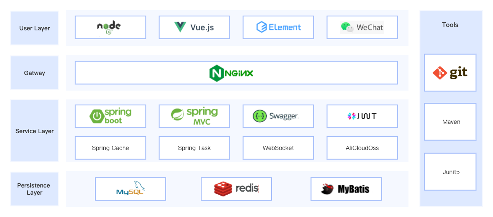
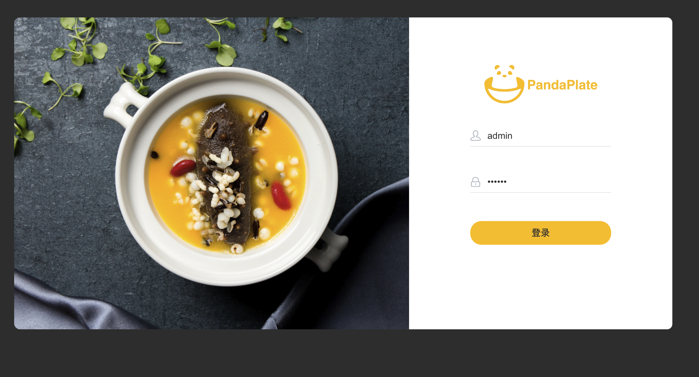
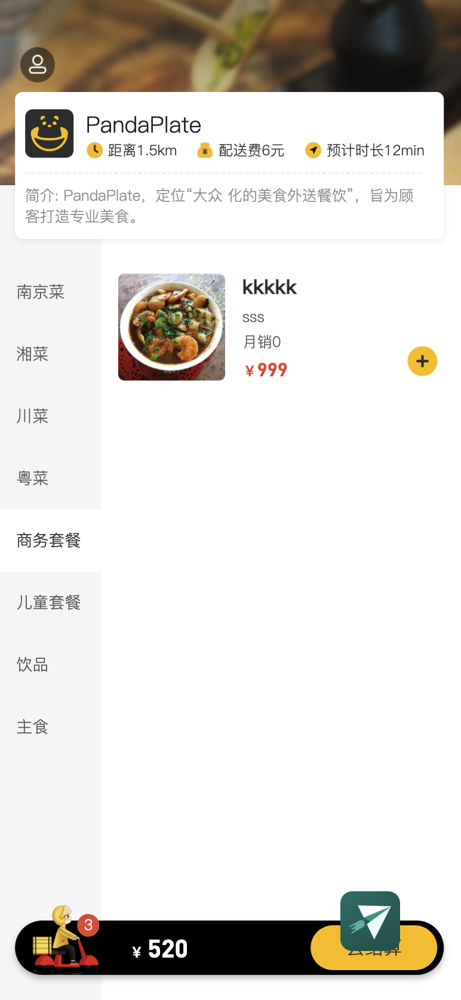

# Panda Plate

## Introduction

Panda Plate - Online Chinese Food Ordering System  

## Tech Stack

## Development environment

1. JDK 11.0.7
2. IntelliJ IDEA 2022.1.4
3. Maven 3.6.1
4. Node.js v16.15.1
5. Redis 6.2.6
6. MySQL 5.7.1

## Front-end and back-end development

### Intro

|          | **Language**     | **Tools**      | **Enviornment** | **Server** |
| -------- | ---------------- | ----------------- | ------------ | ---------- |
| Front-End | JavaScript、HTML | VS Code、Hbuilder | Node.js      | Nginx      |
| Back-End | Java             | IDEA、eclipse     | JDK          | Tomcat     |

## **Project results**

### adminLevel

admin login page

admin main page

### userLevel
